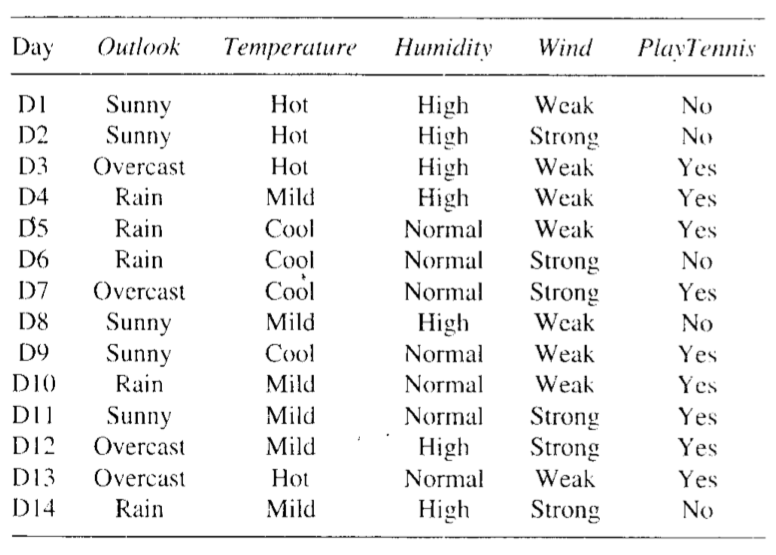
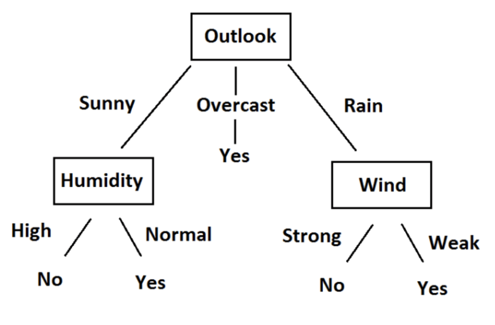

## Learning Objectives [Slides](./Notebooks/simple_Decison_Tree.ipynb)

- Describe a tree based structure for classification
- Define the tree “roots” and “leaves” through entropy and mutual information
- Apply decision trees to lens and tennis datasets

### Decision Tree

- Decision Trees are considered one of the more mature, traditional algorithms in predictive analytics

- They are most likely used for classification problems

### What is Decision Tree?

A tree-like model of decisions and their possible consequences

Example: Predict the contacts lens type that should be prescribed

http://www2.ift.ulaval.ca/~chaib/IFT-4102-7025/public_html/Fichiers/Machine_Learning_in_Action.pdf

Lens dataset: http://archive.ics.uci.edu/ml/machine-learning-databases/lenses/

### Calculate the entropy for a fair coin

- Entropy shows the uncertainty about a random variable

- Show that the fair coin has the largest entropy (uncertainty)
```python
import numpy as np

def entropy(p):
    H = np.array([-i*np.log2(i) for i in p]).sum()
    return H

p = [.5, .5]
entropy(p)
```
### Decision tree illustrations for tennis dataset

- The following table informs about decision making factors to play tennis at outside for previous 14 days



### Activity: Build a decision tree for tennis dataset

Use ID3 algorithm:

Entropy(S) = ∑ – p(I) . log2p(I)

Gain(S, A) = Entropy(S) – ∑  p(S|A) . Entropy(S|A)

Steps: https://sefiks.com/2017/11/20/a-step-by-step-id3-decision-tree-example/

1- Information gain (IG) should be computed between the "Decision column" and all other attributes. The highest score defines the root of the tree

2- Do the IG calculation for leafs and continue

ID3 from scratch in Python: https://www.python-course.eu/Decision_Trees.php

### Result of ID3 for tennis dataset



### For Decision Tree Visualization in Python:

Packages that are needed:

`conda install -c anaconda graphviz`

`conda install -c anaconda pydotplus`

### Activity: Build the decision tree with sklearn for tennis dataset

```python
import pandas as pd
from sklearn.tree import DecisionTreeClassifier
from sklearn import preprocessing
from sklearn.tree import export_graphviz
import pydotplus


data = pd.read_csv('tennis.txt', delimiter="\t", header=None, names=['a', 'b', 'c', 'd', 'e'])
print(data)

data_encoded = data.apply(preprocessing.LabelEncoder().fit_transform)
print(data_encoded)

#
clf = DecisionTreeClassifier(criterion='entropy', max_depth=3)

# one_hot_data = pd.get_dummies(data[['a', 'b', 'c', 'd']], drop_first=True)
# print(one_hot_data)
clf.fit(data_encoded[['a', 'b', 'c', 'd']], data_encoded['e'])


dot_data = export_graphviz(clf, out_file=None, feature_names=['Outlook', 'Temp.', 'Humidity', 'Wind'])

# Draw graph
graph = pydotplus.graph_from_dot_data(dot_data)
graph.write_png('tennis_tree.png')
```
