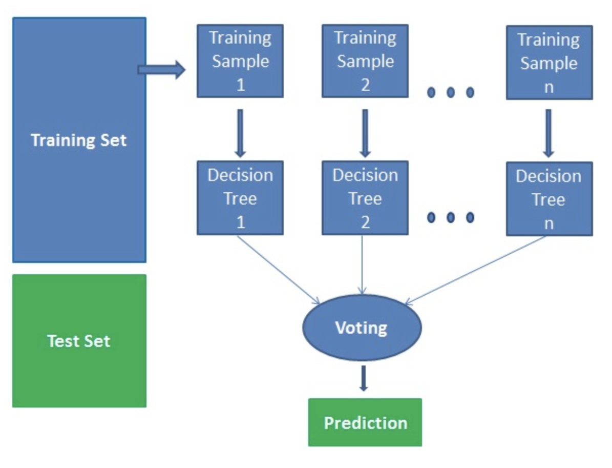
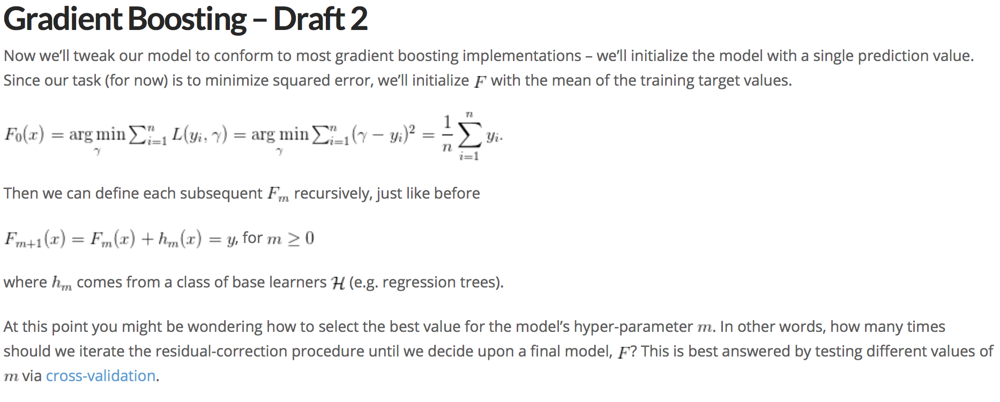
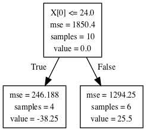

## Learning Objectives [Slides](https://github.com/Make-School-Courses/DS-2.1-Machine-Learning/blob/master/Notebooks/simple_ensemble.ipynb)
- we learn how we can apply multiple ML models and combine each ML model result in an efficient way
- Will talk about Random Forest and Boosting methods

### Ensemble methods

- Ensemble Methods are machine learning algorithms that rely on the "Wisdom of the Crowd"

- Many weak algorithms working together do better than 1 big, monolithic algorithm

- They are two major groups for ensemble methods: ***Random Forests*** and ***Gradient Boosted Trees***

### Random Forest

- Random Forest is a name for a supervised learning

- ***Random Forest*** is just a collection of many small ***Decision Trees***

- Assume we have a dataset with 10 columns, and thousands of rows. Random forest algorithm would start by randomly selecting around 2/3 of the rows, and then randomly selecting 6 columns in the data



### Activity: Apply Random Forest to iris dataset

Read : https://www.datacamp.com/community/tutorials/random-forests-classifier-python

Obtain the feature importance: `clf.feature_importances_`

Change number of estimator (`n_estimators`) and compare the accuracy result

### Gradient Boosting

In boosting, the trees are built sequentially such that each subsequent tree aims to reduce the errors of the previous tree

The tree that grows next in the sequence will learn from an updated version of the residuals

***Demonstrating the Potential of Boosting*** : https://www.analyticsvidhya.com/blog/2018/09/an-end-to-end-guide-to-understand-the-math-behind-xgboost/

Boosting Algorithm:


#### Below is the code that shows how each subsequent work:

```python
from sklearn.tree import DecisionTreeRegressor
import numpy as np
from sklearn.tree import export_graphviz
import pydotplus

X = np.array([5, 7, 12, 23, 25, 28, 29, 34, 35, 40])

Y = np.array([-52, -54, -31, -16, 38, -7, 70, 55, -35, 32])

regre = DecisionTreeRegressor(max_depth=1)
print(X.reshape(-1, 1))
print([[i, j] for (i, j) in zip(X, Y)])
regre.fit(X.reshape(-1, 1), Y.reshape(-1, 1))

dot_data = export_graphviz(regre, out_file=None)

# Draw graph
graph = pydotplus.graph_from_dot_data(dot_data)
graph.write_png('reg_tree.png')
```
#### The first DT regressor in the above boosting example:

