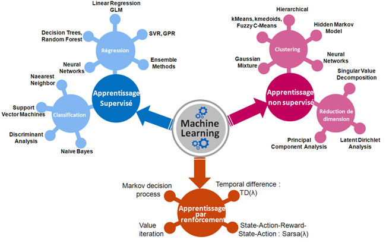
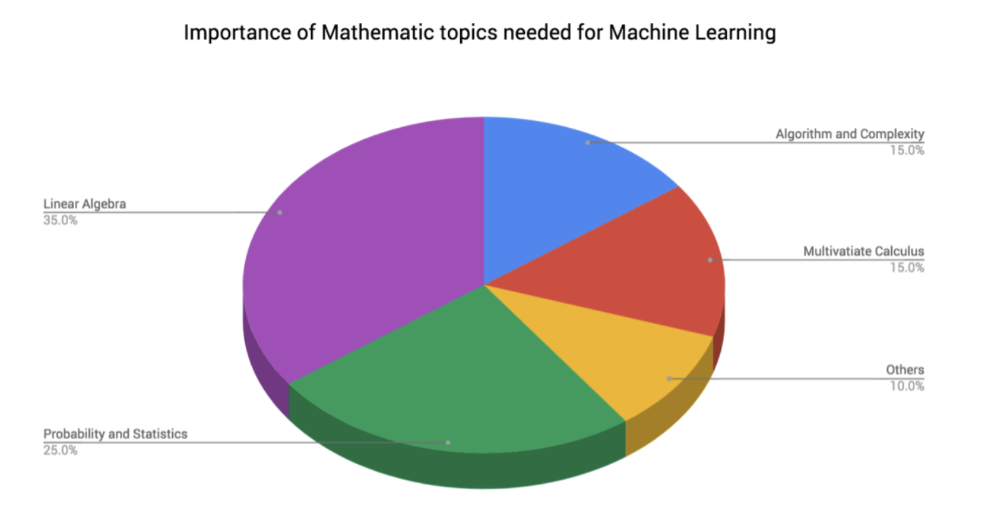

# Introduction to Machine Learning

## Class Learning Objectives/Competencies (5 min)

1. What is data analysis, machine learning and data engineer?
1. What topics DS 2.1 covers?
1. OOP paradigm in Sklearn

## What we have learned in DS 1.1 as a Data Analyst?
- Learned the principles of effective storytelling
- You begin making proposals and decisions based on analysis
- You Explored Data Analysis (EDA), you focused on the basics of statistical inference, hypothesis testing, correlation
Check this out as a good resource for Data Analyst/ Data Engineer/ Data Scientist roles:
https://www.springboard.com/blog/wp-content/uploads/2016/07/UltimateGuidetoDataScienceInterviews-1.pdf

## What we are going to learn in DS 2.1 which covers Machine Learning?

### what is machine learning?
- Use data and algorithm that predict or classify the unseen upcoming data with acceptable accuracy

### Two major machine learning algorithm:
- Supervised Learning
- Unsupervised Learning
The supervised learning is used to do:
Regression --> Temperature prediction, stock market prediction, next purchased item prediction
Classification --> Is an email spam or not-spam, is dog in the image or cat, is a comment about a post positive or negative or neutral
The unsupervised learning is used to do:
Cluster data into groups
Reduce the dimension of features

## Machine Learning Components:


## What Level of Math Do We Need for Machine Learning?
I do recommend to refresh or learn the following topics:
- Calculus
- Linear Algebra
- Probability and statistics


## How do we evaluate the machine learning models?
For supervised learning it is possible to evaluate the model from train and test data
For regression, the evaluation metrics are:
- Mean Squared Error (MSE)
- Mean Absolute Error (MAE)
For classification, the evaluation metrics are:
- Classification Accuracy
- Classification Recall, Precision and F1 score
For unsupervised learning there are no systematic approach to evaluate the models but the are ways to do it

## Scaling, Normalization, One-hot encoding, Label encoding
Please read: https://www.tutorialspoint.com/machine_learning_with_python/machine_learning_with_python_quick_guide.htm

Please read: http://scikit-learn.org/stable/modules/preprocessing.html
http://scikit-learn.org/stable/modules/generated/sklearn.preprocessing.normalize.html

Also, look at the first page here: https://www.analyticsvidhya.com/infographics/Scikit-Learn-Infographic.pdf

```Python
import numpy as np
X_train = np.array([[ 1., -1.,  2.], [ 2.,  0.,  0.], [ 0.,  1., -1.]])
(X_train[:,0]-X_train[:,0].mean())/X_train[:,0].std()
(X_train[:,1]-X_train[:,1].mean())/X_train[:,1].std()
(X_train[:,2]-X_train[:,2].mean())/X_train[:,2].std()
(X_train-X_train.mean(axis=0))/X_train.std(axis=0)


X_test = [[-1., 1., 0.]]
(-1 - X_train[:,0].mean())/X_train[:,0].std()
(1 - X_train[:,1].mean())/X_train[:,1].std()
(0 - X_train[:,2].mean())/X_train[:,2].std()

# How preprocessing.MinMaxScaler() works
(X_train - X_train.min(axis=0)) / (X_train.max(axis=0) - X_train.min(axis=0)
```

## The Python package that we use for ML
- Sklearn
The OOP paradigm for all Sklearn models:
https://www.springboard.com/blog/wp-content/uploads/2016/07/UltimateGuidetoDataScienceInterviews-1.pdf
